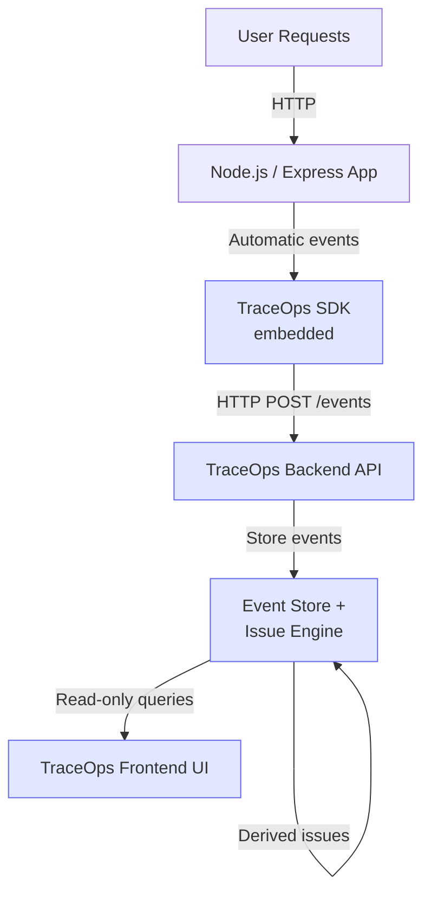
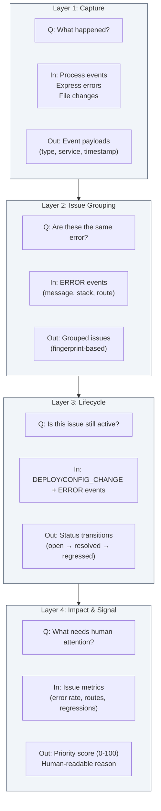
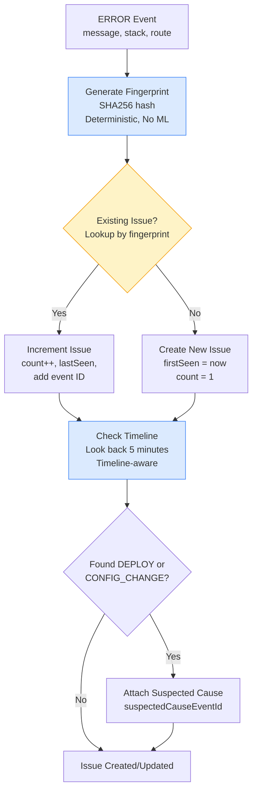
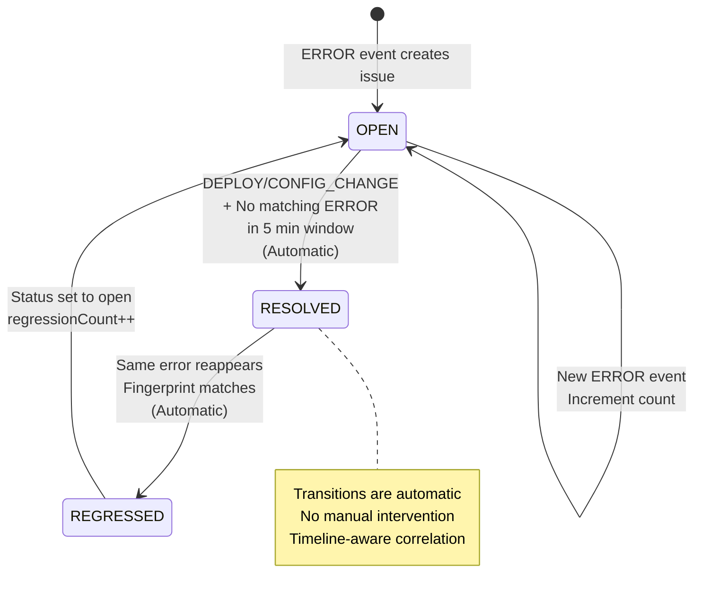

# TraceOps Architecture Diagrams

Engineering-first architecture documentation for TraceOps incident prioritization engine.

---

## 1. High-Level System Architecture

**Goal**: Show how TraceOps fits into a real backend deployment.

### ASCII Sketch
```
[ User Requests ]
        ↓
[ Node.js / Express App ]
        ↓
[ TraceOps SDK (embedded) ]
        ↓ HTTP POST /events
[ TraceOps Backend API ]
        ↓
[ Event Store + Issue Engine ]
        ↓ Derived issues
[ TraceOps Frontend UI ]
        ↑ Read-only queries
```

### Mermaid Diagram



### Key Points
- **SDK is embedded** inside the backend application process
- **SDK sends events** over HTTP to the TraceOps Backend API
- **Backend derives issues** automatically from events (no manual configuration)
- **Frontend is read-only** - it queries issues but never writes events or issues

---

## 2. Layered Architecture Diagram (Core)

**Goal**: Explain the mental model of TraceOps's four logical layers.

### ASCII Sketch
```
┌─────────────────────────────────────┐
│ Layer 4: Impact & Signal            │
│ Priority Score, Needs Attention     │
│ Q: What needs human attention?      │
│ In: Issue metrics                   │
│ Out: Priority score (0-100)         │
└─────────────────────────────────────┘
┌─────────────────────────────────────┐
│ Layer 3: Lifecycle                  │
│ Open / Resolved / Regressed         │
│ Q: Is this issue still active?      │
│ In: DEPLOY/CONFIG_CHANGE + ERROR    │
│ Out: Status transitions             │
└─────────────────────────────────────┘
┌─────────────────────────────────────┐
│ Layer 2: Issue Grouping              │
│ Error → Fingerprint → Issue          │
│ Q: Are these the same error?         │
│ In: ERROR events                     │
│ Out: Grouped issues                  │
└─────────────────────────────────────┘
┌─────────────────────────────────────┐
│ Layer 1: Capture                    │
│ Deploy / Error / Config Change      │
│ Q: What happened?                    │
│ In: Process events, Express errors   │
│ Out: Event payloads                 │
└─────────────────────────────────────┘
```

### Mermaid Diagram



### Layer Details

**Layer 1: Capture**
- Answers: "What happened?"
- Input: Process events (uncaught exceptions, unhandled rejections), Express route errors, process start signals, environment file changes
- Output: Event payloads (eventType, serviceName, timestamp, message, metadata)

**Layer 2: Issue Grouping**
- Answers: "Are these the same error?"
- Input: ERROR events with message, stack trace, and route metadata
- Output: Issues grouped by deterministic fingerprint (SHA256 hash)

**Layer 3: Lifecycle**
- Answers: "Is this issue still active?"
- Input: DEPLOY/CONFIG_CHANGE events, existing open issues, ERROR events after triggers
- Output: Issue status transitions (open → resolved → regressed)

**Layer 4: Impact & Signal**
- Answers: "What needs human attention?"
- Input: Issue with related event IDs, event metadata (routes, users), time windows
- Output: Priority score (0-100), severity level, human-readable reason

---

## 3. Event → Issue Flow Diagram

**Goal**: Show how raw errors become actionable issues.

### ASCII Sketch
```
ERROR Event
   │
   ↓
Fingerprint Generation
   │ (SHA256 hash of message + stack + route)
   │ Deterministic, No ML
   ↓
Existing Issue?
   ├── Yes → Increment count
   │         Update lastSeen
   │         Add event ID
   └── No  → Create new issue
             firstSeen = now
             count = 1
   ↓
Check Timeline
   │ (Look back 5 minutes)
   ↓
DEPLOY or CONFIG_CHANGE found?
   ├── Yes → Attach suspected cause
   └── No  → Continue
   ↓
Issue Created/Updated
```

### Mermaid Diagram



### Key Characteristics

- **Deterministic**: Same error always produces same fingerprint
- **No ML**: Pure hash-based grouping, no machine learning
- **Timeline-aware**: Correlates errors with recent DEPLOY/CONFIG_CHANGE events within 5-minute window

---

## 4. Incident Lifecycle Diagram

**Goal**: Show why TraceOps is different from basic logging - automatic resolution tracking.

### ASCII Sketch
```
[ OPEN ]
   │
   │ Trigger: DEPLOY or CONFIG_CHANGE
   │ Check: No matching ERROR in 5 min window
   │ Action: Automatic
   ↓
[ RESOLVED ]
   │ resolvedAt = trigger timestamp
   │ resolvedByEventId = trigger event ID
   │
   │ Trigger: Same error reappears
   │ Check: Fingerprint matches
   │ Action: Automatic
   ↓
[ REGRESSED ]
   │ regressionCount++
   │ status = open
   │
   │ (Cycle repeats)
```

### Mermaid Diagram



### State Transitions

**OPEN → RESOLVED**
- Trigger: DEPLOY or CONFIG_CHANGE event occurs
- Check: No ERROR events with matching fingerprint appear within 5-minute window after trigger
- Action: Automatically mark issue as resolved
- Metadata: Set `resolvedAt` and `resolvedByEventId`

**RESOLVED → REGRESSED**
- Trigger: ERROR event with matching fingerprint appears
- Check: Fingerprint comparison (exact match)
- Action: Automatically increment `regressionCount` and set status back to `open`

**All transitions are automatic** - no manual intervention required.

---

## 5. Priority Scoring Diagram

**Goal**: Explain how "Needs Attention" issues are identified.

### ASCII Sketch
```
Inputs:
├── Error rate (errors/min in last 60 min)
├── Unique routes affected
├── Regression count
└── Recency (hours since first seen)

        ↓

Processing:
├── Severity determination
│   ├── Base: message keywords, count
│   ├── Escalate: error rate > 10 → critical
│   ├── Escalate: regression count > 0
│   └── Escalate: unique routes > 1
├── Priority score calculation
│   ├── Base score: severity (20-80)
│   ├── + Error rate component (0-15)
│   ├── + Regression component (0-10)
│   └── + Recency component (0-10)
└── Cap at 100

        ↓

Output:
├── Priority Score (0-100)
├── Human-readable reason
└── Appears in "Needs Attention" if score > threshold
```

### Mermaid Diagram

```mermaid
flowchart LR
    subgraph Inputs["Inputs"]
        ER[Error Rate<br/>errors/min<br/>last 60 min]
        Routes[Unique Routes<br/>affected]
        Reg[Regression Count]
        Recency[Recency<br/>hours since<br/>first seen]
    end
    
    subgraph Processing["Processing"]
        Sev[Severity Determination<br/>Base: keywords, count<br/>Escalate: rate, regressions, routes]
        Calc[Priority Score Calculation<br/>Base: 20-80 by severity<br/>+ Error rate: 0-15<br/>+ Regression: 0-10<br/>+ Recency: 0-10<br/>Cap at 100]
    end
    
    subgraph Outputs["Outputs"]
        Score[Priority Score<br/>0-100]
        Reason[Human-readable Reason<br/>e.g., "High error rate (12.5/min),<br/>Regressed 2 times"]
        NeedsAttention[Appears in<br/>"Needs Attention"<br/>if score > threshold]
    end
    
    Inputs --> Processing
    Processing --> Outputs
    
    style Inputs fill:#f1f5f9,stroke:#475569
    style Processing fill:#e0e7ff,stroke:#6366f1
    style Outputs fill:#dbeafe,stroke:#3b82f6
```

### Scoring Formula

**Severity Base Score**
- Critical: 80
- High: 60
- Medium: 40
- Low: 20

**Components Added**
- Error rate component: `min(15, errorRate * 1.5)`
- Regression component: `min(10, regressionCount * 5)`
- Recency component: `10` if < 1 hour, else `max(0, 10 - hoursSinceFirstSeen / 6)`

**Final Score**
- Sum all components
- Cap at 100
- Multiply by 0.3 if status is "resolved"

**Priority Reason Examples**
- "High error rate (12.5/min), Regressed 2 times"
- "Critical severity, Recently introduced"
- "High error rate (8.2/min)"
